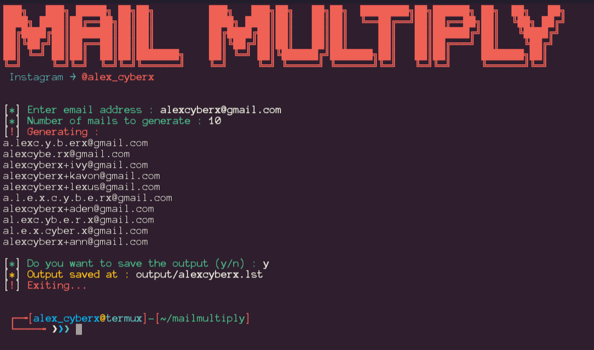

# Mail Multiply 

### MAKE UNLIMITED GMAILS

- To use this tool you need an valid and working mail account already. </br>
- Run the tool enter your working mail address and it asks for number of mail address to generate, type any number say like 10000 hit enter. </br>
- It will then generate tons of mails, use those mails for any purpose. </br>
- All the messages sent to generated mails, you will receive it on your valid mail which you have entered at the starting.
- Also tested with **protonmail, yahoomail** works very well.

You can generate mails and use it to mass signin a website, it saves output in ".lst" file. Can be used in pentesting of web app or applications. Works well with mostly all the websites while some websites blocks such emails.

[Watch tutorial on instagram]()

# Screenshot

</img>

## Installing and requirements

- Pyhton3
- Linux or Unix-based system

### Installing

```
~ ❯❯❯ git clone https://github.com/alexcyberx/mailmultiply.git

~ ❯❯❯ cd mailmultiply

~/mailmultiply ❯❯❯ chmod +x mailmultiply.sh

~/mailmultiply ❯❯❯ ./mailmultiply.sh
```

### For termux (android)

```
$ apt-get install python

$ git clone https://github.com/alexcyberx/mailmultiply.git

$ cd mailmultiply

$ chmod +x mailmultiply.sh

$ ./mailmultiply.sh
```

## Contact

[Gmail](mailtosend)(alexcyberx42@gmail.com) </br>
[Instagram](https://instagram.com/alex_cyberx) </br>
## Disclaimer

Mail Multiply is created to help in penetration testing and it's not responsible for any misuse or illegal purposes.

## License

This work by [alexcyberx](https://github.com/alexcyberx) is licensed under the terms of the [MIT License]
